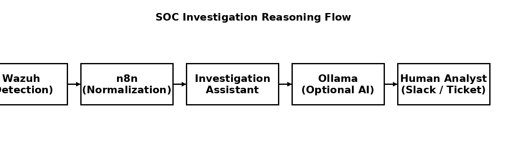

# AI SOC Investigation Assistant


An **explainable SOC investigation assistant** that transforms security alerts into
structured investigation reasoning, hypotheses, and recommended next steps.

Designed for **Security Operations Centres (SOCs)** and **security research**, with a
strong emphasis on **human-in-the-loop decision support** rather than automated response.

---

## 🔍 Motivation

Modern SOCs generate alerts, not investigations.

Analysts must interpret incomplete signals, correlate context, form hypotheses, and justify decisions under time pressure. This project focuses on **investigation reasoning** rather than detection or automated response.

---

## 🧠 Core Principles

- Explainability first — all output is human-readable Markdown
- Human-in-the-loop — advisory only, no automated decisions
- AI is optional — system works fully without AI
- Modular design — SIEM-agnostic, workflow-driven
- Research-friendly — deterministic baseline + optional AI refinement

---

## 🧩 SOC / DFIR Toolchain Context



This assistant operates at the **investigation reasoning layer** of a SOC workflow.

---

## 🔗 Wazuh → n8n → AI Investigation Assistant

This project is designed to integrate cleanly into a modern SOC pipeline:

```
Wazuh → n8n → Investigation Assistant → (optional) Ollama → Analyst
```

### Wazuh (Detection Layer)
- Generates security alerts using rules and decoders
- Sends alerts in JSON format via webhook
- Focuses solely on detection

### n8n (Normalization & Orchestration)
- Receives alerts from Wazuh
- Filters noise and low-severity events
- Normalizes alert schemas
- Controls when AI is used
- Routes investigation output to downstream systems

### AI SOC Investigation Assistant (Reasoning Layer)
- Consumes normalized alerts
- Produces structured investigation notes
- Generates hypotheses and recommended next steps
- Makes **no automated decisions**

### Optional: Ollama (Local AI)
- Refines investigation reasoning
- Advisory only
- No cloud dependency or API keys

### Human Analyst (Decision Layer)
- Reviews investigation output
- Makes final decisions
- Maintains accountability

---

## 📥 Input Model

The assistant expects normalized alert data (typically provided by n8n):

```json
{
  "summary": "Outbound connection to rare external IP",
  "source": "Wazuh",
  "severity": "Medium",
  "context": {
    "agent": "server01",
    "srcip": "192.168.1.10",
    "dstip": "45.67.89.10",
    "rule_id": "100100"
  }
}
```

---

## 📤 Output Model

The assistant produces structured investigation notes in Markdown:

```md
# SOC Investigation Notes

## Alert Summary
Outbound connection to rare external IP

## Initial Observations
- Source: Wazuh
- Severity: Medium

## Hypotheses
- Possible misconfiguration
- Opportunistic scanning
- Benign application behavior

## Recommended Next Steps
1. Review historical activity
2. Identify owning service
3. Correlate with other alerts

## Confidence
Low
```

---

## 🚀 Running the Assistant

```bash
pip install fastapi uvicorn
uvicorn assistant:app --host 0.0.0.0 --port 8000
```

---

## 🔧 API Usage

**Endpoint**
```
POST /investigate
```

Example:

```bash
curl -X POST http://localhost:8000/investigate   -H "Content-Type: application/json"   -d '{
    "summary": "Outbound connection to rare IP",
    "source": "Firewall",
    "severity": "Medium"
  }'
```

---

## 🎓 Research & Educational Value

This repository supports research and teaching in:

- explainable AI for security operations
- decision-support systems
- SOC analyst cognition and trust
- reproducible investigation workflows

---

## 📜 License

MIT
