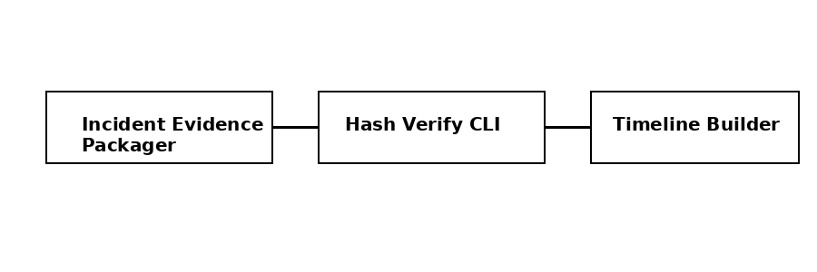

# AI SOC Investigation Assistant


An **explainable SOC investigation assistant** that converts security alerts into
structured investigation reasoning, hypotheses, and recommended next steps.

---

## Purpose

This project provides **decision-support for SOC analysts**, not automated response.
It focuses on transparency, reproducibility, and human-in-the-loop investigation.

---

## Architecture



```
Wazuh → n8n → Investigation Assistant → (optional) Ollama → Analyst
```

---

## Wazuh → n8n → Assistant Flow

### Wazuh
- Detects suspicious activity
- Sends JSON alerts via webhook

### n8n
- Receives and normalizes alerts
- Filters noise and severity
- Orchestrates investigation flow

### Investigation Assistant
- Generates structured investigation notes
- Produces hypotheses and next steps
- No automated decisions

### Optional: Ollama
- Local AI refinement
- Advisory only

---

## Running the Assistant

```bash
pip install fastapi uvicorn
uvicorn assistant:app --host 0.0.0.0 --port 8000
```

---

## License

MIT
